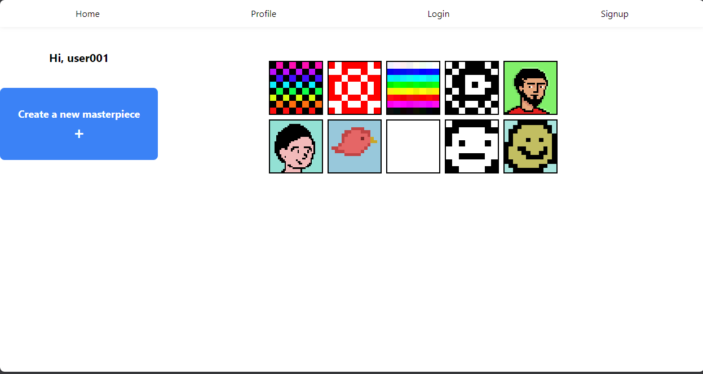

# Pixelite Documentation



## Overview

Welcome to the Pixelite web application! This React-based project allows digital artists to create pixel art using a range of square canvas sizes. Tailwind CSS is utilized for styling, and JavaScript arrays are used for pixel management instead of an HTML canvas. The application features canvas size selection, color palette customization, and the ability to download the created pixel art. The project is fully responsive, ensuring a seamless experience across various screen sizes.

## Features

- **Canvas Sizes**: Users can choose from a fixed range of square canvas sizes to suit their artistic preferences.

- **Color Palette**: Change the color of your 'pen' to create vibrant and dynamic pixel art.

- **Download Artwork**: Save your pixel art creations by downloading them directly from the application.

## How to Create Pixel Art

### Get a local copy

1. Clone the repository to your local machine.
   ```bash
   git clone https://github.com/your-username/pixel-art-creator.git
   ```

2. Navigate to the project directory and install dependencies.
   ```bash
   cd pixel-art-creator
   npm install
   ```

3. Start the development server.
   ```bash
   npm start
   ```

4. Open your web browser and visit `http://localhost:3000`.

5. Choose a canvas size, pick your colors, and start creating pixel art!

### View the live site

Alternatively, you can view the [live site](https://theavocadocoder.github.io/pixelite/)

## Future Updates

Stay tuned for exciting updates! Future versions of the Pixel Art Creator will include user accounts for persistent artwork storage.

## About Me

I am a junior developer with a passion for combining technology and creativity. This project reflects my dedication to leveraging modern technologies and frameworks to enhance the user experience.

Feel free to reach out if you have any questions or suggestions for improvement!

Happy pixel art creating! 🎨
